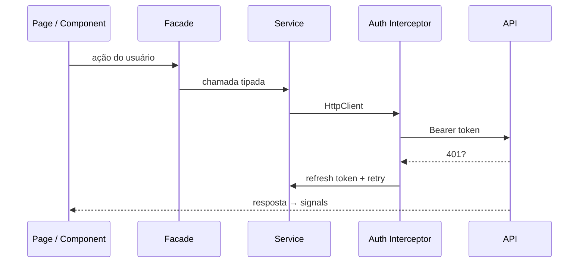
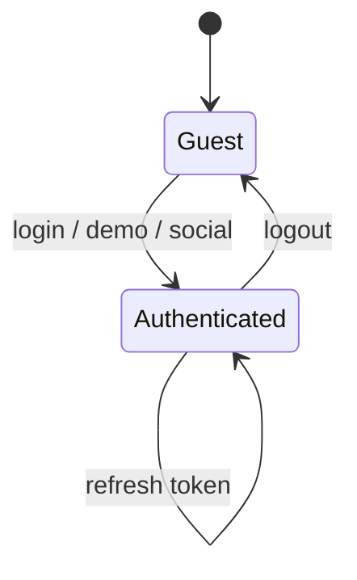

# Titan — Enterprise Angular Template

Boilerplate **Angular 21** pronto para produção, pensado para aplicações enterprise (bancos, fintechs, healthtechs, ERPs e SaaS). Arquitetura **standalone-first**, **SSR + hydration**, **signals**, **facades**, **JWT + RBAC** e design system com **Spartan UI** + **Tailwind CSS v4**.

---

## Índice

- [Tecnologias](#tecnologias)
- [Documentação oficial](#documentação-oficial)
- [Pré-requisitos](#pré-requisitos)
- [Início rápido](#início-rápido)
- [Autenticação demo](#autenticação-demo)
- [Scripts disponíveis](#scripts-disponíveis)
- [Ambientes e builds](#ambientes-e-builds)
- [Estrutura do projeto](#estrutura-do-projeto)
- [Convenções de código](#convenções-de-código)
- [Arquitetura](#arquitetura)
- [Autenticação e autorização](#autenticação-e-autorização)
- [UI e componentes](#ui-e-componentes)
- [Testes](#testes)
- [API e mocks](#api-e-mocks)
- [Docker e CI](#docker-e-ci)
- [Estender o template](#estender-o-template)
- [Anti-patterns](#anti-patterns)
- [Solução de problemas](#solução-de-problemas)
- [Licença](#licença)

---

## Tecnologias

| Categoria | Tecnologia | Uso no Titan |
|-----------|------------|--------------|
| Framework | [Angular 21](https://angular.dev) | Standalone components, signals, `bootstrapApplication` |
| Renderização | [Angular SSR](https://angular.dev/guide/ssr) | Server-side rendering + hydration |
| Estilo | [Tailwind CSS v4](https://tailwindcss.com) | Utility-first, tema zinc |
| UI | [Spartan UI](https://www.spartan.ng) | Preset brain + primitives (shadcn-style) |
| Variantes UI | [class-variance-authority](https://cva.style/docs) | Variants em botões e componentes |
| Utilitários CSS | [clsx](https://github.com/lukeed/clsx) + [tailwind-merge](https://github.com/dcastil/tailwind-merge) | Função `cn()` em `shared/utils` |
| Ícones | [@lucide/angular](https://lucide.dev/guide/packages/lucide-angular) | Ícones SVG (quando necessário) |
| Estado | Angular **Signals** | `AuthStore`, `SignalStateService` — sem NgRx |
| Async | [RxJS 7](https://rxjs.dev) | HTTP, interceptors, facades |
| HTTP | `HttpClient` + interceptors | JWT, refresh, retry, timeout |
| Testes | [Jest](https://jestjs.io) + [jest-preset-angular](https://thymikee.github.io/jest-preset-angular/) | Unit tests |
| Testes UI | [Angular Testing Library](https://testing-library.com/docs/angular-testing-library/intro/) | Testes orientados ao usuário |
| Mocks | [MSW](https://mswjs.io) | API fake em desenvolvimento |
| Contratos API | [Orval](https://orval.dev) + OpenAPI | Geração de clients a partir de `openapi/` |
| Qualidade | ESLint + Prettier + Husky + lint-staged | Lint e format no pre-commit |
| Runtime SSR | [Express 5](https://expressjs.com) | Servidor Node para build SSR |
| CDK | [Angular CDK](https://material.angular.io/cdk/categories) | Overlays (requisito Spartan) |

**Não utilizado (por design):** NgModules tradicionais, Karma, Jasmine, NgRx, TSLint.

---

## Documentação oficial

| Recurso | Link |
|---------|------|
| Angular | https://angular.dev |
| Angular CLI | https://angular.dev/tools/cli |
| Angular SSR | https://angular.dev/guide/ssr |
| Signals | https://angular.dev/guide/signals |
| Standalone | https://angular.dev/guide/components/importing |
| Spartan UI — instalação | https://www.spartan.ng/documentation/installation |
| Spartan UI — componentes | https://www.spartan.ng/documentation |
| Tailwind CSS v4 | https://tailwindcss.com/docs |
| RxJS | https://rxjs.dev/guide/overview |
| Jest | https://jestjs.io/docs/getting-started |
| Testing Library (Angular) | https://testing-library.com/docs/angular-testing-library/intro/ |
| MSW | https://mswjs.io/docs/ |
| Orval | https://orval.dev/overview |
| class-variance-authority | https://cva.style/docs |
| OpenAPI Specification | https://swagger.io/specification/ |

---

## Pré-requisitos

- **Node.js** 20+ (recomendado 22 LTS)
- **npm** 10+ (o projeto usa `npm@11` via `packageManager`)

```bash
node -v   # v20+
npm -v
```

---

## Início rápido

```bash
# Clonar / entrar no projeto
cd titan

# Instalar dependências
npm install

# Servidor de desenvolvimento (config local = demo ativo)
npm start
```

Abra [http://localhost:4200](http://localhost:4200).

> **Importante:** `npm start` usa `--configuration=local`, que carrega `src/environments/environment.ts` com **demo auth** habilitado. Não use `ng serve` sem `--configuration=local` se quiser o modo demo padrão.

---

## Autenticação demo

Em ambiente **local** (`mockApi` + `featureFlags.demoAuth`), o login **não depende de API externa** nem de MSW.

### Credenciais

| Campo | Valor |
|-------|--------|
| Email | `admin@titan.dev` (ou qualquer email válido no formulário) |
| Senha | `password123` |

### Formas de entrar

1. **Entrar com conta demo** — um clique; ignora falhas de rede/API.
2. **Sign in** — com os dados acima (formulário já vem pré-preenchido).
3. **Google / GitHub / Microsoft** — em modo demo, autentica localmente (sem OAuth real).

### Logout

O botão **Logout** no dashboard:

- Limpa **sempre** sessão e `localStorage` (demo, dev, hml, prod).
- Tenta revogar no servidor em segundo plano (não bloqueia se a API falhar).
- Redireciona para `/auth/login`.

### Badge na tela de login

Se aparecer **"Modo demo (local)"**, o bypass está ativo. Se não aparecer, verifique a configuração do `ng serve` (veja [Ambientes](#ambientes-e-builds)).

---

## Scripts disponíveis

| Comando | Descrição |
|---------|-----------|
| `npm start` | `ng serve --configuration=local` — dev com demo |
| `npm run build` | Build padrão (production) |
| `npm run build:dev` | Build com `environment.dev.ts` |
| `npm run build:hml` | Build homologação |
| `npm run build:prod` | Build produção |
| `npm run serve:ssr:titan` | Servir build SSR (`node dist/titan/server/server.mjs`) |
| `npm test` | Jest — suite completa |
| `npm run test:watch` | Jest em modo watch |
| `npm run test:coverage` | Cobertura de testes |
| `npm run lint` | ESLint em `src/**/*.ts` |
| `npm run lint:fix` | ESLint com auto-fix |
| `npm run format` | Prettier em TS/HTML/SCSS/JSON |
| `npm run api:generate` | Gerar client a partir de `openapi/titan-api.yaml` (Orval) |
| `npm run clean:modules` | Remove `node_modules` (com retry no Windows) |
| `npm run reinstall` | `clean:modules` + `npm ci` |

---

## Ambientes e builds

| Config Angular | Arquivo de environment | Uso |
|----------------|------------------------|-----|
| `local` | `environment.ts` | **Desenvolvimento padrão** — demo auth, `apiUrl: /api` |
| `development` | `environment.dev.ts` | Dev com demo + mock (substitui environment) |
| `hml` | `environment.hml.ts` | Homologação |
| `production` | `environment.prod.ts` | Produção |

```bash
# Desenvolvimento local (recomendado)
npm start
# equivalente a:
ng serve --configuration=local

# Homologação
ng build --configuration=hml

# Produção
npm run build:prod
```

### Variáveis principais (`environment.ts`)

```typescript
{
  production: false,
  name: 'local',
  apiUrl: '/api',
  mockApi: true,
  featureFlags: {
    demoAuth: true,  // bypass de login local
    socialLogin: true,
    commandPalette: true,
  },
}
```

`ConfigService.isDemoAuthEnabled` retorna `true` quando `mockApi` ou `featureFlags.demoAuth` estão ativos.

---

## Estrutura do projeto

```
titan/
├── openapi/                 # Contrato OpenAPI (Orval)
├── public/                  # Assets estáticos + MSW worker
├── packages/
│   └── create-titan/        # Stub CLI para scaffold
├── src/
│   ├── app/                 # Bootstrap, rotas, config
│   ├── core/                # Auth, HTTP, config, state, errors, i18n
│   ├── shared/              # UI, RBAC, theme, utils
│   ├── features/            # Login, dashboard, shell
│   ├── infrastructure/      # Adapters (Supabase, Firebase)
│   ├── environments/        # local, dev, hml, prod
│   ├── styles.scss          # Tailwind v4 + tokens Spartan (zinc)
│   └── testing/             # Jest setup + MSW handlers
├── angular.json
├── jest.config.ts
├── orval.config.ts
├── docker-compose.yml
└── .github/workflows/ci.yml
```

### Camadas (`src/`)

| Pasta | Responsabilidade |
|-------|------------------|
| `app/` | `app.routes.ts`, `app.config.ts`, root component |
| `core/` | Regras de negócio transversais: auth, HTTP, config, estado global |
| `shared/` | UI reutilizável, diretivas RBAC, tema, helpers |
| `features/` | Funcionalidades (login, dashboard) com facade + pages |
| `infrastructure/` | Integrações externas (adapters) |
| `environments/` | Configuração por ambiente |
| `testing/` | Mocks MSW e setup Jest |

---

## Convenções de código

### Arquivos por componente / page

Cada UI element usa **arquivos separados** (sem template inline no TypeScript):

```
dashboard.page.ts
dashboard.page.html
dashboard.page.scss
dashboard.page.spec.ts

button.component.ts
button.component.html
button.component.scss
button.component.spec.ts
```

### Tipagem (obrigatório)

Interfaces, types e enums **não** ficam dentro de components, services, facades ou stores.

```
✅ src/core/auth/types/auth-user.interface.ts
✅ src/core/auth/enums/social-provider.enum.ts
❌ Declarar interface dentro de login.page.ts
```

### Path aliases (`tsconfig.json`)

| Alias | Caminho |
|-------|---------|
| `@app/*` | `src/app/*` |
| `@core/*` | `src/core/*` |
| `@shared/*` | `src/shared/*` |
| `@features/*` | `src/features/*` |
| `@infrastructure/*` | `src/infrastructure/*` |
| `@environments/*` | `src/environments/*` |

---

## Arquitetura

### Princípios

- **Clean Architecture** — UI → Facade → Store/Service → HTTP/Adapters
- **Standalone-first** — sem `AppModule`; `provideRouter`, `provideHttpClient`, `provideClientHydration`
- **Smart / Dumb** — pages finas; facades orquestram fluxos
- **Signals** para estado de UI; **RxJS** para fluxos assíncronos (HTTP)
- **OnPush** nos componentes de UI

### Fluxo de requisição HTTP



### Ciclo de autenticação



### Rotas

| Rota | Guard | Descrição |
|------|-------|-----------|
| `/auth/login` | `guestGuard` | Login (redireciona se já autenticado) |
| `/app` | `authGuard` + `permissionGuard(['app:read'])` | Área autenticada |
| `/app` (child) | — | Dashboard |

---

## Autenticação e autorização

### Peças principais

| Peça | Arquivo | Função |
|------|---------|--------|
| `AuthService` | `core/auth/auth.service.ts` | Login, logout, refresh, persistência |
| `AuthStore` | `core/auth/auth.store.ts` | Estado em signals |
| `AuthFacade` | `core/auth/auth.facade.ts` | API para a UI |
| `authInterceptor` | `core/auth/interceptors/` | JWT + refresh em 401 |
| Guards | `core/auth/guards/` | `auth`, `guest`, `role`, `permission` |
| `PermissionDirective` | `shared/rbac/directives/` | `*appHasPermission="'admin:write'"` |

### Demo vs API real

| Modo | Comportamento |
|------|----------------|
| `demoAuth` / `mockApi` | Login local instantâneo; logout limpa sessão sem depender da API |
| Produção | `POST /auth/login`, refresh, logout no backend configurado em `apiUrl` |

Constantes demo: `src/core/auth/constants/demo-auth.constants.ts`

---

## UI e componentes

### Design system

- Tema **zinc** (light/dark) em `src/styles.scss`
- Preset Spartan: `@import "@spartan-ng/brain/hlm-tailwind-preset.css"`
- Dark mode: classe `.dark` no `<html>` via `ThemeService`

### Componentes incluídos

| Componente | Seletor | Notas |
|------------|---------|-------|
| Button | `app-button` | CVA variants; output `(pressed)` para ações |
| Input | `app-input` | `ControlValueAccessor` para reactive forms |
| Skeleton | `app-skeleton` | Loading placeholder |

### Adicionar componentes Spartan

```bash
npx ng g @spartan-ng/cli:ui
```

Documentação: https://www.spartan.ng/documentation/installation

### Botões e eventos

Use `(pressed)` no `app-button` (não `(click)` no host):

```html
<app-button variant="destructive" (pressed)="logout()">Logout</app-button>
```

`type="submit"` continua funcionando com `form` + `ngSubmit`.

---

## Testes

```bash
npm test
npm run test:coverage
```

- Config: `jest.config.ts`
- Setup: `src/testing/setup-jest.ts`
- Exemplos: `*.spec.ts` em guards, facades e componentes

Padrão recomendado: **Angular Testing Library** para pages; mocks de `AuthFacade` / `Router` em testes unitários.

---

## API e mocks

### OpenAPI + Orval

Contrato: `openapi/titan-api.yaml`

```bash
npm run api:generate
# saída configurada em orval.config.ts → src/infrastructure/api/generated
```

### MSW (opcional)

Handlers: `src/testing/mocks/handlers.ts`

O worker é registrado em `src/main.ts` quando `environment.mockApi === true`. O **login demo** funciona mesmo sem MSW, pois usa bypass em `AuthService`.

Para reinicializar o worker:

```bash
npx msw init public/ --save
```

---

## Docker e CI

### Docker

```bash
docker compose up --build
```

- `titan-web`: app SSR (porta 4000)
- `nginx`: reverse proxy (porta 8080)

### CI (GitHub Actions)

Workflow: `.github/workflows/ci.yml`

1. `npm ci`
2. `npm run lint`
3. `npm run test:coverage`
4. `npm run build:prod`

---

## Estender o template

### Nova feature

1. Criar pasta `src/features/<nome>/`
2. Adicionar `*.page.ts`, `*.page.html`, `*.page.scss`, `*.page.spec.ts`
3. Criar `<nome>.facade.ts` para orquestração
4. Registrar rota lazy em `src/app/app.routes.ts`

```typescript
{
  path: 'reports',
  loadComponent: () =>
    import('@features/reports/reports.page').then((m) => m.ReportsPage),
}
```

### Novo componente UI

```bash
ng generate component shared/ui/card --standalone --style=scss
```

Seguir o padrão de arquivos separados e variants com CVA quando aplicável.

### Scaffold de projeto (CLI stub)

```bash
# Pacote em packages/create-titan (em evolução)
npm create titan@latest my-app
```

---

## Anti-patterns

| Evitar | Preferir |
|--------|----------|
| NgModules para features | Standalone + `import[]` |
| Types dentro de `.component.ts` | `types/`, `interfaces/`, `enums/` |
| `HttpClient` direto na page | Facade + `BaseHttpService` |
| NgRx para estado local de tela | Signals + `SignalStateService` |
| `(click)` no host de `app-button` | `(pressed)` |
| `ng serve` sem config em dev local | `npm start` (`--configuration=local`) |
| Karma / Jasmine | Jest + Testing Library |

---

## Solução de problemas

### `npm ci` — `EPERM: operation not permitted, unlink` (Windows)

O Windows bloqueia arquivos `.node` nativos (ex.: `@unrs/resolver-binding-win32-x64-msvc`) quando algum processo Node ainda está em execução.

**Causas comuns**

- `npm start` / `ng serve` rodando em outro terminal
- ESLint ou language service do IDE segurando o arquivo
- Antivírus escaneando `node_modules`

**Solução (ordem recomendada)**

1. Pare o dev server (`Ctrl+C` no terminal do `npm start`)
2. Feche terminais Node extras ou reinicie a janela do IDE
3. Rode a reinstalação limpa do projeto:

```bash
npm run reinstall
```

Se ainda falhar, encerre processos Node e tente de novo:

```bash
# Git Bash / CMD no Windows
taskkill //F //IM node.exe

npm run reinstall
```

> **Atenção:** `taskkill` encerra **todos** os processos Node (incluindo outros projetos).

**CI (GitHub Actions)** — o workflow usa `ubuntu-latest` e não deve apresentar esse erro. Se a esteira usar runner **Windows** self-hosted, aplique os mesmos passos antes do `npm ci` ou prefira runner Linux.

---

## Licença

MIT
